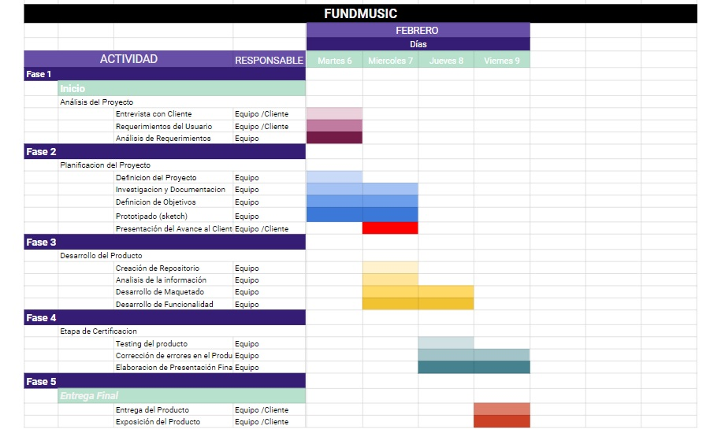
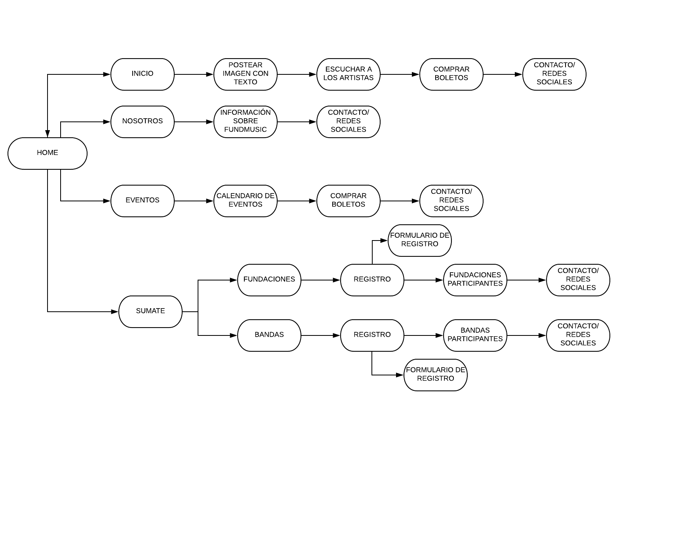
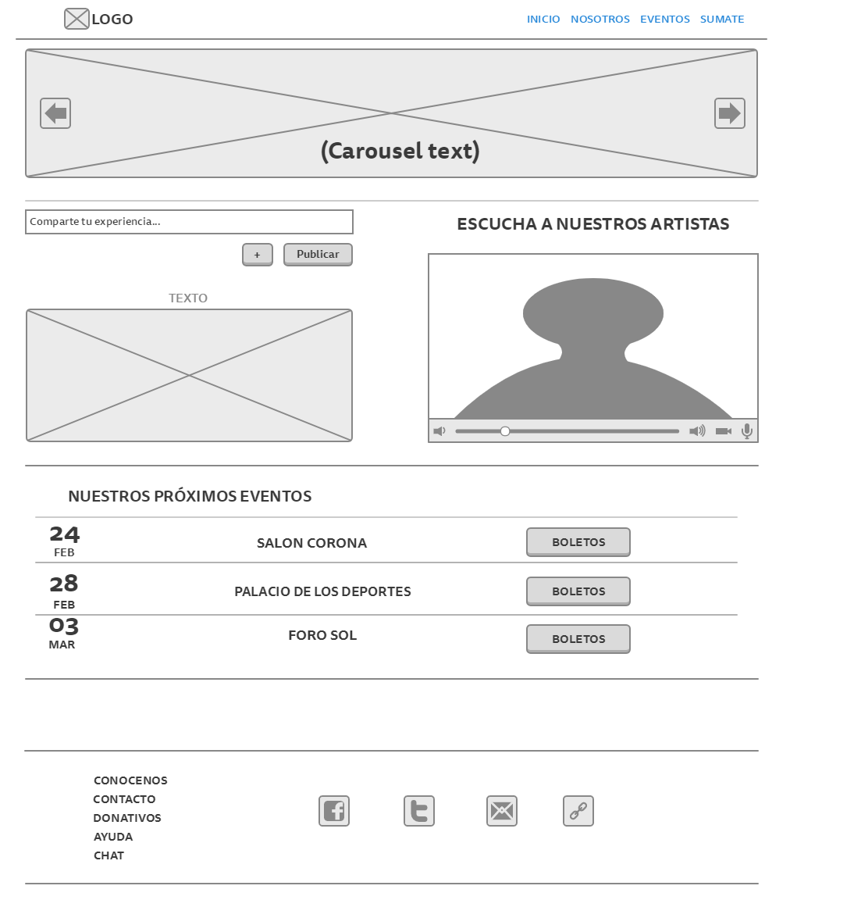
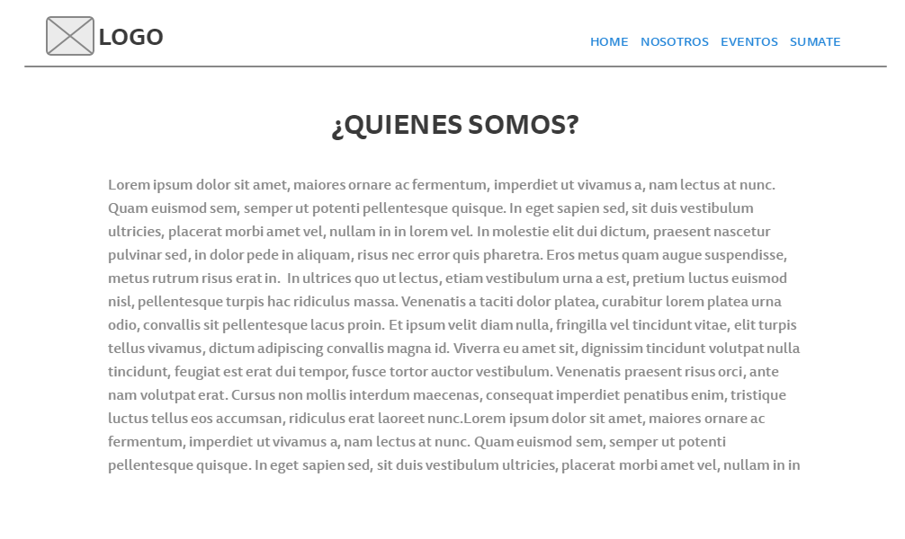
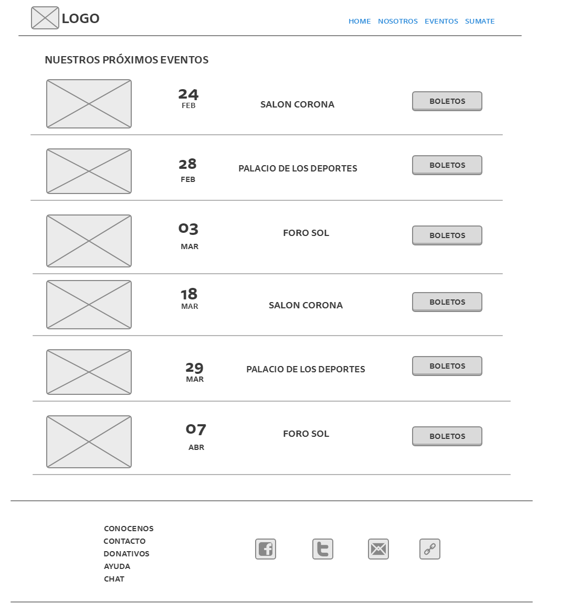
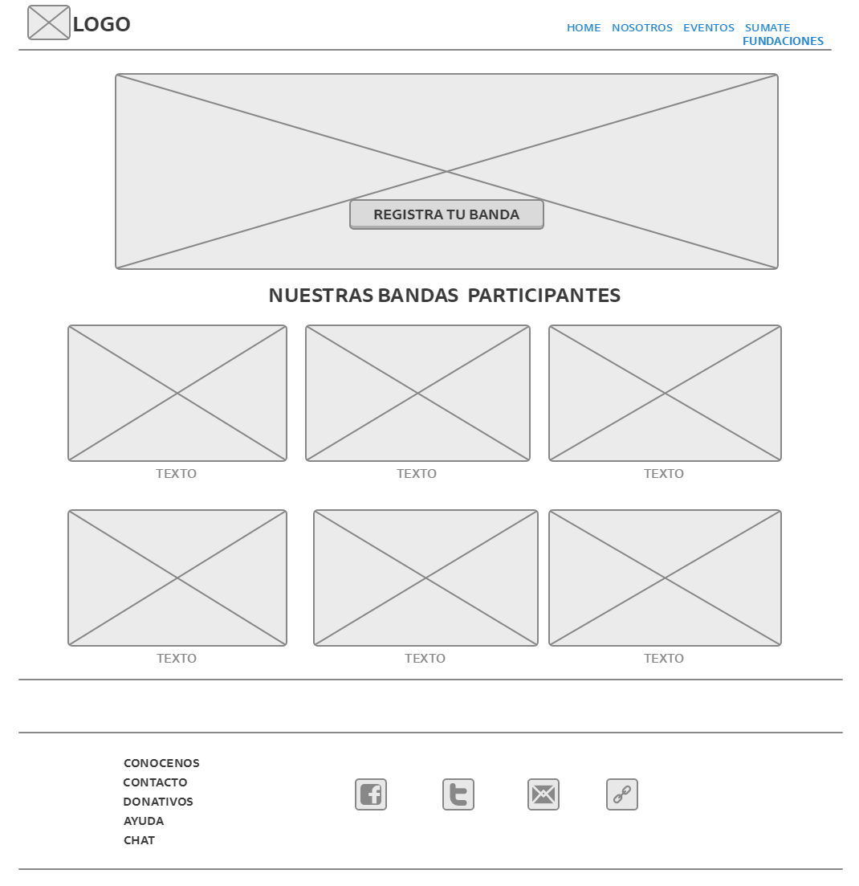
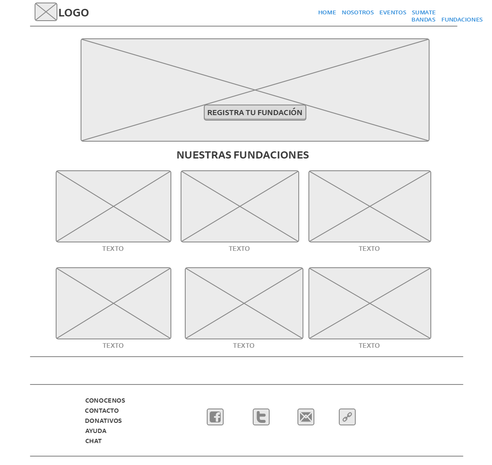
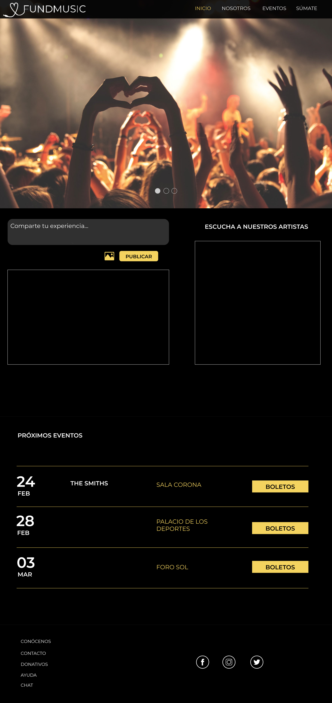

#FundMusic

## FundMusic es una plataforma digital dedicada a apoyar fundaciones con causa por medio de conciertos de beneficencia.

#### La idea surgió a partir de la necesidad de impulsar a nuevas y experimentadas banda a abrirse paso y ser reconocidas, y qué mejor que ayudando.

1. Para desarrollar este proyecto hemos realizado un cronograma con el plan de trabajo y un research para 3 diferentes perfiles: usuarios, bandas y fundaciones.

**Links de research:**

USUARIOS:
https://es.surveymonkey.com/analyze/data-trends/j1EzZWcJlpHAQpSTQJS2DIBHi11BPzsmpMQoqpaqR6k_3D

BANDAS:
https://es.surveymonkey.com/analyze/browse/7uv8AaSptCB0ifgZ_2FBK9Fosd62TAWTNuRWz8kZ2ErL8_3D

FUNDACIONES:
https://es.surveymonkey.com/analyze/fhiY0s4efm4OMO0YePiqzzH2hM8uEfqkgRUu2RC0w_2B4_3D&tab_clicked=1

2. A partir de que el proyecto fue del gusto de éstos tres perfiles, hemos desarrollado la arquitectura de la información.

3. Depues, hemos creado el mockup con 5 diferentes vistas.

** Primer vista (Home):** En esta vista se muestra un carousel con diferentes imagenes promocionales, tambien el usuario podrá compartir sus experiencias por medio de una imagen y un texto. Y posteriormente el usuario podrá visualizar nuestros proximos eventos y tener la facilidad de adquirir boletos.
Y por último el usuraio podrá encontrar una sección de contacto y redes sociales.

** Segunda vista (NOSOTROS):**

* En esta vista el usuraio podrá conocer más sobre la iniciativa de FundMusic y su visión.
Y por último el usuraio podrá encontrar una sección de contacto y redes sociales.

** Tercera vista (Eventos): **

* En esta tercer vista el usuraio podrá visualizar los conciertos que hay deacuerdo a fecha y lugar con una imagen o flyer de la banda.
Y por último el usuraio podrá encontrar una sección de contacto y redes sociales.

** Cuarta vista (Sumate):**

* En esta vista las bandas podrán resgistrarse por medio de un botón principal que direcciona a un formulario, y que al completarlo te regresa a la misma vista para que pueda seguir visualizando a las bandas participantes.
Y por último la banda podrá encontrar una sección de contacto y redes sociales.

** Quinta vista (Sumate, Fundaciones): **

* En esta vista las fundaciones podrán resgistrarse por medio de un botón principal que direcciona a un formulario, y que al completarlo te regresa a la misma vista para que pueda seguir visualizando a las fundaciones participantes.
Y por último la fundación podrá encontrar una sección de contacto y redes sociales.

## WIREFRAME

## PALETA DE COLORES

